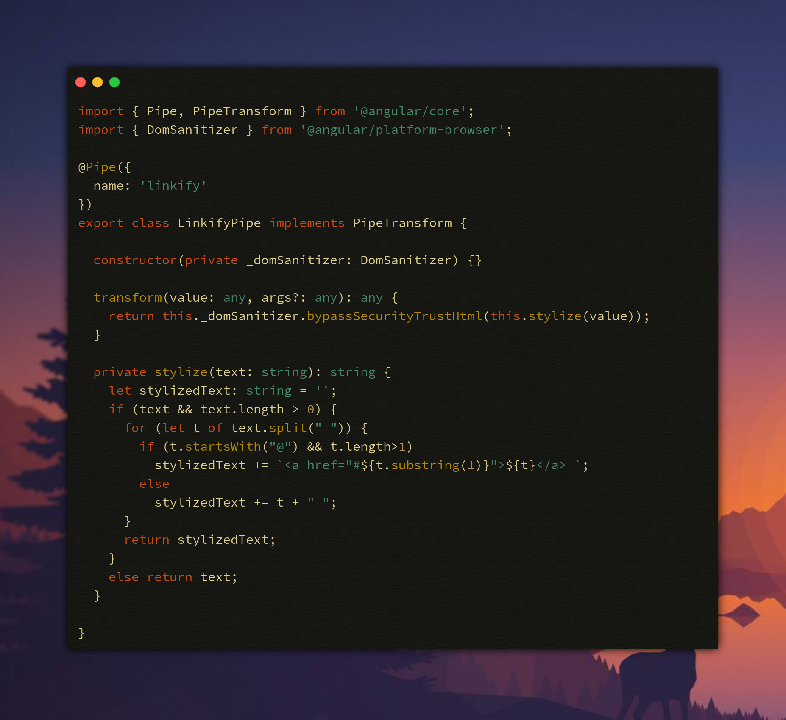

# code2img
An API to get pretty images of code snippets with syntax highlighting created using Express, Puppeteer and PrismJS.

## Sample image generated by code2img



## Tech Used
| Technology | Description                                                                           | Link ↘️                 |
| ---------- | ------------------------------------------------------------------------------------- | ----------------------- |
| CSS3       | Cascading Style Sheets                                                                | https://developer.mozilla.org/en-US/docs/Web/CSS                    |
| Express       | Web Framework for Node.js                                                          | https://expressjs.com/  |
| HTML5      | Hyper Text Markup Language                                                            | https://developer.mozilla.org/en-US/docs/Web/HTML                    |
| JavaScript | High Level, Dynamic, Interpreted Language                                             | https://developer.mozilla.org/en-US/docs/Web/JavaScript                    |
| NodeJS     | Open Source, Javascript Run Time Environment, Execute Javascript code for server side | https://nodejs.org/en/  |
| Puppeteer       | Node library which provides a high-level API to control Chromium over the DevTools protocol | https://pptr.dev |

## Installation

### Running Locally

_Make sure [Node.js](https://nodejs.org/en/) and [NPM](https://www.npmjs.com/) are installed._

1. Clone/Download the repository and `cd` into the project directory

```bash
git clone https://github.com/cyberpirate92/code2img.git
cd code2img
```

2. Install dependencies

```bash
npm install
```

3. Run the dev server

```bash
npm run dev
```

The app will now be running at https://localhost:3000

## Using the API

## Using Postman

Postman is a API client that can be easily used to test APIs.

1. Download and install Postman from https://www.postman.com/downloads/
2. Open Postman and import the file `Postman/code2img.postman_collection.json`.
3. In the code2img collection, you can find the requests

## API Documentation

The API supports the following operations

1. Get Image
2. List themes
3. List languages

### 1. Get Image

- HTTP Method: `POST`
- Endpoint: `/api/to-image`
- Content-Type: `text/plain`
- Response Content Type: `image/png`

**Query Parameters**

| Parameter | Description                                                                           | Possible values                 |
| ---------- | ------------------------------------------------------------------------------------- | ----------------------- |
| theme       | The name of the color theme. All the color themes are from  https://github.com/PrismJS/prism-themes                                                                | `a11y-dark`, `atom-dark`, `base16-ateliersulphurpool.light`, `cb`, `darcula`, `default`, `dracula`, `duotone-dark`, `duotone-earth`, `duotone-forest`, `duotone-light`, `duotone-sea`, `duotone-space`, `ghcolors`, `hopscotch`, `material-dark`, `material-light`, `material-oceanic`, `nord`, `pojoaque`, `shades-of-purple`, `synthwave84`, `vs`, `vsc-dark-plus`, `xonokai`                     |
| language | The name of the programming language. This will be used for syntax highlighting                                                                           | `c`, `css`, `cpp`, `go`, `html`, `java`, `javascript`, `python`, `rust`, `typescript`                 |
| line-numbers | Show/Hide line numbers. Defaults to `false`.                                                                           | `true`, `false`                 |
| scale | The device scale factor used to render the image. Higher values will lead to bigger image resolutions and higher file sizes. Default value is `2` | Any value in the inclusive range `1`-`5` |

**Description:** Given a code snippet in the request body, an image will be returned with the specified theme and language options.

### 2. List themes
- HTTP Method: `GET`
- Endpoint: `/api/themes`
- Response Content Type: `application/json`

**Description:** Get a list of all supported themes.

### 3. List languages
- Http Method: `GET`
- Endpoint: `/api/languages`
- Response Content Type: `application/json`

**Description:** Get a list of all supported languages.